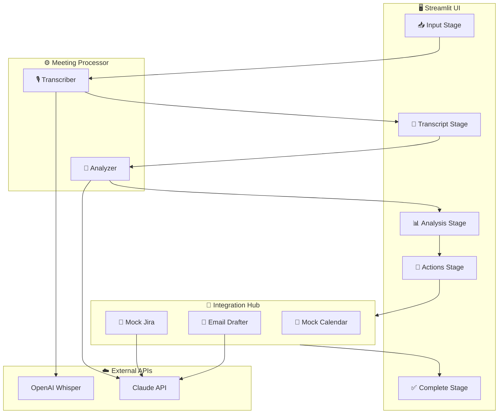
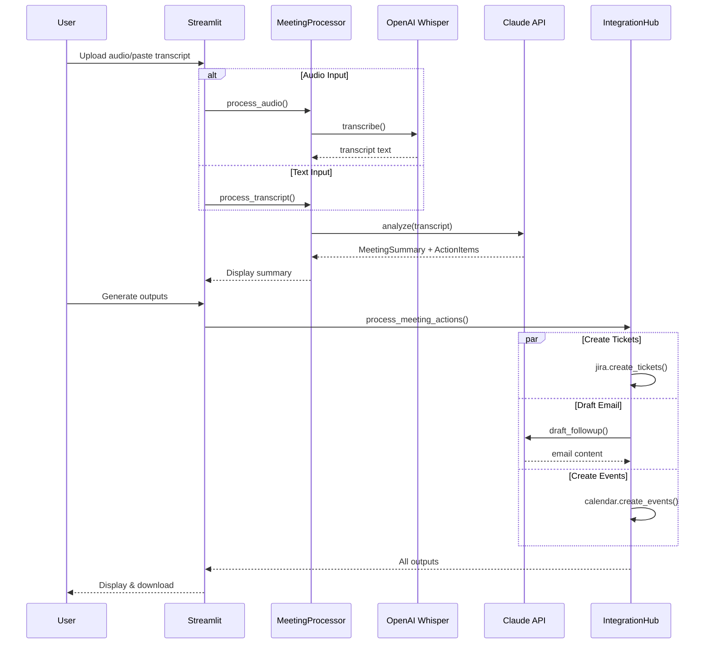
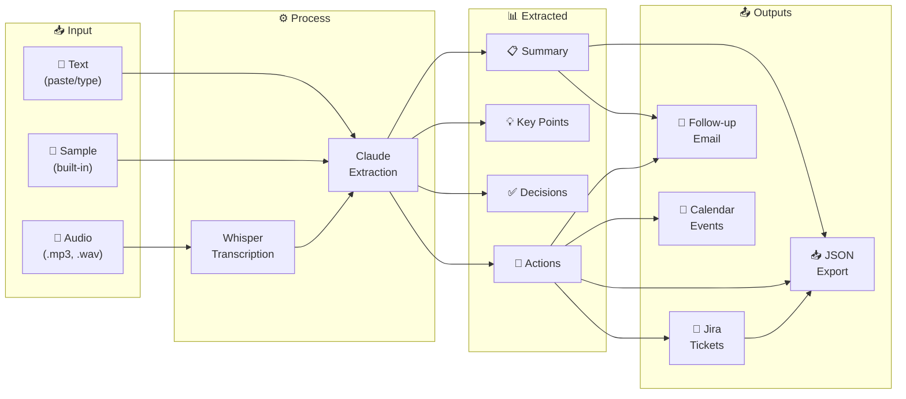
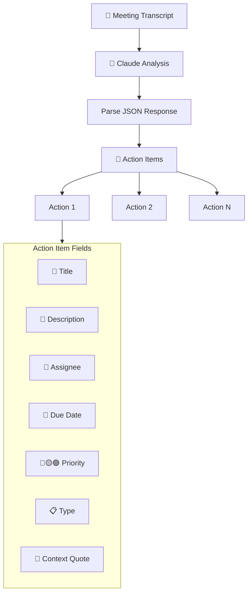
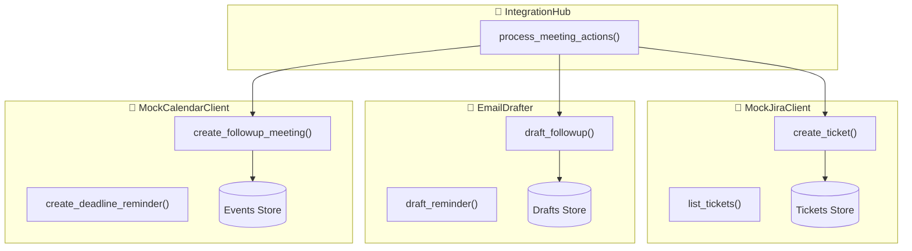
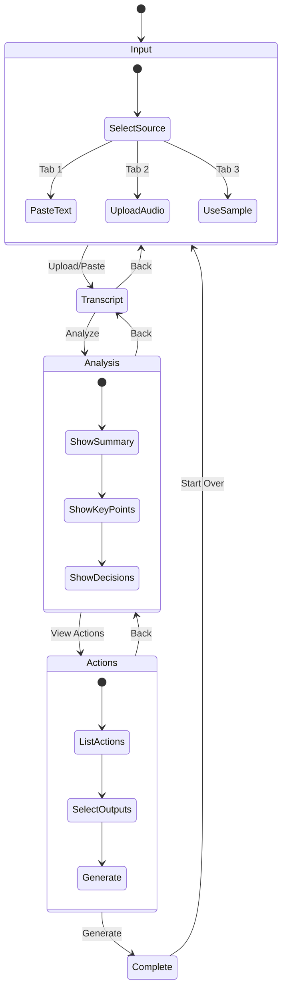
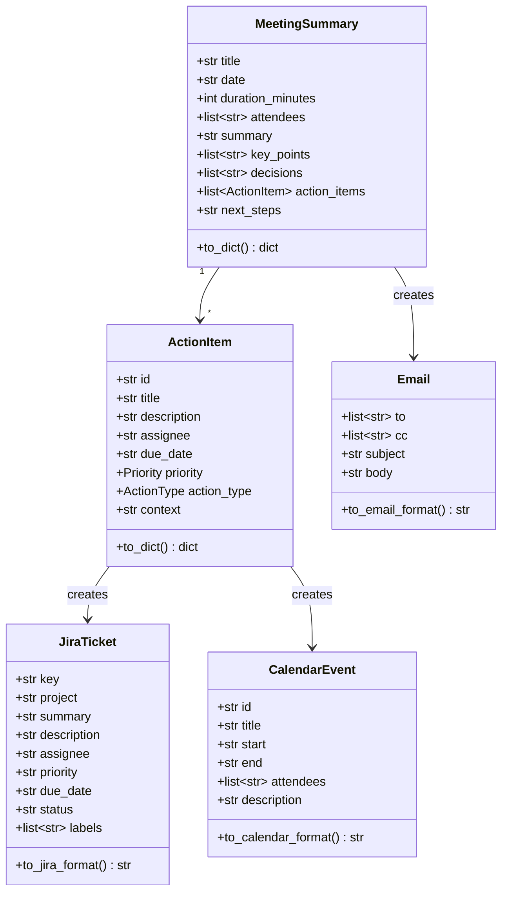
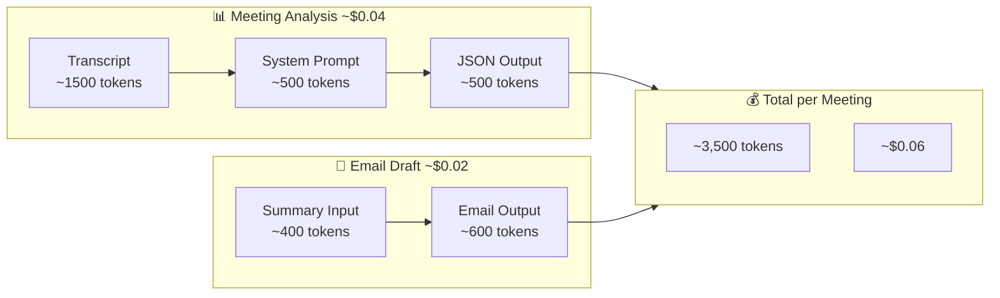
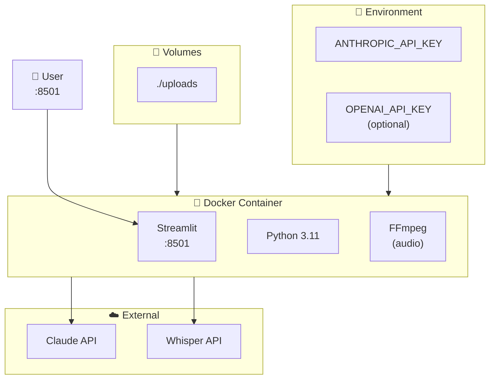

# 📋 Meeting Pipeline - Architecture Diagrams

## System Overview

## End-to-End Pipeline

## Data Flow

## Action Item Extraction

## Integration Hub

## UI State Machine

## Data Models

## Token Flow

## Deployment Architecture

---

## Quick Reference

| Component | File | Purpose |
|-----------|------|---------|
| 🎙️ Transcriber | `meeting_processor.py` | Whisper integration |
| 🧠 Analyzer | `meeting_processor.py` | Claude extraction |
| 🎫 Jira | `meeting_integrations.py` | Mock ticket creation |
| 📧 Email | `meeting_integrations.py` | AI email drafting |
| 📅 Calendar | `meeting_integrations.py` | Event creation |
| 🖥️ UI | `meeting_app.py` | Streamlit interface |

---

*Part of [learn-agentic-stack](https://github.com/kraghavan/learn-agentic-stack) - Project 4.3*