# 📋 Meeting Notes → Action Items Pipeline

> **Project 4.3** from the Agentic AI Learning Pathway
> End-to-end meeting processing with action extraction and integrations

## Overview

Process meeting audio or transcripts into actionable outputs: summaries, Jira tickets, follow-up emails, and calendar events.

## Architecture

```
┌─────────────────────────────────────────────────────────────────┐
│                    MEETING PIPELINE                             │
│                                                                 │
│   🎤 Audio                    📝 Transcript                     │
│      │                            │                             │
│      ▼                            │                             │
│  ┌────────────┐                   │                             │
│  │  Whisper   │                   │                             │
│  │ (OpenAI)   │───────────────────┤                             │
│  └────────────┘                   │                             │
│                                   ▼                             │
│                          ┌────────────────┐                     │
│                          │   Claude AI    │                     │
│                          │  (Extraction)  │                     │
│                          └───────┬────────┘                     │
│                                  │                              │
│              ┌───────────────────┼───────────────────┐          │
│              │                   │                   │          │
│              ▼                   ▼                   ▼          │
│       ┌──────────┐        ┌──────────┐        ┌──────────┐     │
│       │  📋      │        │  🎯      │        │  📝      │     │
│       │ Summary  │        │ Actions  │        │ Decisions│     │
│       └──────────┘        └────┬─────┘        └──────────┘     │
│                                │                                │
│              ┌─────────────────┼─────────────────┐              │
│              ▼                 ▼                 ▼              │
│       ┌──────────┐      ┌──────────┐      ┌──────────┐         │
│       │ 🎫 Jira  │      │ 📧 Email │      │ 📅 Cal   │         │
│       │ Tickets  │      │  Draft   │      │ Events   │         │
│       └──────────┘      └──────────┘      └──────────┘         │
│                                                                 │
└─────────────────────────────────────────────────────────────────┘
```

## Pipeline Flow (Mermaid)

```mermaid
flowchart TB
    subgraph Input["📥 Input"]
        Audio["🎤 Audio File"]
        Text["📝 Transcript"]
    end

    subgraph Transcription["🎙️ Transcription"]
        Whisper["OpenAI Whisper"]
    end

    subgraph Analysis["🧠 AI Analysis"]
        Extract["Claude: Extract Info"]
    end

    subgraph Outputs["📊 Extracted Data"]
        Summary["📋 Summary"]
        Actions["🎯 Action Items"]
        Decisions["✅ Decisions"]
        Attendees["👥 Attendees"]
    end

    subgraph Integrations["🔗 Integrations"]
        Jira["🎫 Jira Tickets"]
        Email["📧 Follow-up Email"]
        Calendar["📅 Calendar Events"]
    end

    Audio --> Whisper
    Whisper --> Extract
    Text --> Extract
    
    Extract --> Summary
    Extract --> Actions
    Extract --> Decisions
    Extract --> Attendees
    
    Actions --> Jira
    Summary --> Email
    Actions --> Email
    Actions --> Calendar
```



## Features

- [x] **Audio Transcription** - OpenAI Whisper (with mock option)
- [x] **AI Summarization** - Key points, decisions, next steps
- [x] **Action Extraction** - Title, assignee, due date, priority
- [x] **Mock Jira** - Create tickets from action items
- [x] **Email Drafting** - AI-written follow-up emails
- [x] **Calendar Events** - Schedule follow-ups and reminders
- [x] **Export** - Download all outputs as JSON

## Quick Start

```bash
cd ~/learn-agentic-stack/claude-code-labs/03-production-apps
mkdir meeting-pipeline && cd meeting-pipeline

# Copy files:
# meeting_processor.py, meeting_integrations.py, meeting_app.py, requirements.txt

python3 -m venv .venv && source .venv/bin/activate
pip install -r requirements.txt

export ANTHROPIC_API_KEY="your-key"
# Optional for real transcription:
# export OPENAI_API_KEY="your-key"
# brew install ffmpeg
# ffprobe -version
# python3.12 audio_transcript_generator.py
# meeting_sync.mp3 will be generated

streamlit run meeting_app.py #. upload the mp3 for transcription by chatGPT
```

## File Mapping

| Source File | Rename To |
|-------------|-----------|
| `meeting_processor.py` | `meeting_processor.py` |
| `meeting_integrations.py` | `meeting_integrations.py` |
| `meeting_app.py` | `meeting_app.py` |
| `meeting_requirements.txt` | `requirements.txt` |

## Usage

1. **Input** - Paste transcript, upload audio, or use sample
2. **Review** - Check and edit the transcript
3. **Analyze** - AI extracts summary and action items
4. **Actions** - Review extracted action items
5. **Generate** - Create Jira tickets, email, calendar events
6. **Export** - Download all outputs

## Extracted Data

### Action Items
```json
{
  "id": "action_1",
  "title": "Review authentication flow",
  "description": "Review and provide comments on auth design",
  "assignee": "Mike",
  "due_date": "2024-01-15",
  "priority": "high",
  "action_type": "task",
  "context": "Mike: I can do that. I'll have comments ready by Monday."
}
```

### Meeting Summary
```json
{
  "title": "Weekly Sync",
  "date": "2024-01-08",
  "attendees": ["John", "Sarah", "Mike"],
  "summary": "Team discussed API redesign progress...",
  "key_points": ["API design phase complete", "..."],
  "decisions": ["Target end of month for beta"],
  "action_items": [...],
  "next_steps": "Sarah to share specs, Mike to review auth"
}
```

## Mock Integrations

The integrations are mocked for learning purposes:

| Integration | What It Does |
|-------------|--------------|
| **Jira** | Creates ticket objects with keys like `MEET-1` |
| **Email** | AI drafts professional follow-up emails |
| **Calendar** | Creates event objects for follow-ups |

To connect real services, extend the classes in `meeting_integrations.py`.

## Learning Outcomes

- ✅ Audio processing pipelines
- ✅ Information extraction with LLMs
- ✅ Structured data extraction (JSON)
- ✅ Multi-output pipelines
- ✅ Service integration patterns
- ✅ End-to-end workflow design

## Sample Transcripts Included

1. **Weekly Sync** - Team standup with task assignments
2. **Sprint Planning** - Capacity planning and commitments

## Token Usage

| Operation | Tokens | Cost |
|-----------|--------|------|
| Meeting analysis | ~2,500 | ~$0.04 |
| Email drafting | ~1,000 | ~$0.02 |
| Per meeting | ~3,500 | ~$0.06 |

---

*Part of [learn-agentic-stack](https://github.com/kraghavan/learn-agentic-stack)*
