# 📚 Personal Knowledge Base - Architecture Diagrams

## System Overview

```mermaid
flowchart TB
    subgraph UI["🖥️ Streamlit UI"]
        Chat["💬 Chat"]
        Upload["📤 Upload"]
        Search["🔍 Search"]
        Docs["📄 Documents"]
        Graph["🕸️ Graph"]
    end

    subgraph Core["🧠 Core Modules"]
        DP["📄 Document Processor"]
        KB["🗄️ Knowledge Base"]
        RAG["🤖 RAG Chat"]
        KG["🕸️ Knowledge Graph"]
    end

    subgraph Storage["💾 Storage"]
        ChromaDB[(ChromaDB)]
        Index[("document_index.json")]
    end

    subgraph External["☁️ External"]
        Claude["Claude API"]
    end

    %% UI to Core connections
    Chat --> RAG
    Upload --> DP
    Search --> KB
    Docs --> KB
    Graph --> KG

    %% Core interconnections
    DP --> KB
    RAG --> KB
    RAG --> Claude
    KG --> KB
    KG --> Claude

    %% Storage connections
    KB --> ChromaDB
    KB --> Index
```

## Document Ingestion Pipeline

```mermaid
flowchart LR
    subgraph Input["📁 Input Files"]
        PDF["📕 PDF"]
        MD["📝 Markdown"]
        TXT["📄 Text"]
        Code["💻 Code"]
    end

    subgraph Processing["⚙️ Document Processor"]
        Extract["1️⃣ Extract Text"]
        Detect["2️⃣ Detect Type"]
        Chunk["3️⃣ Smart Chunking"]
        Meta["4️⃣ Add Metadata"]
    end

    subgraph Output["📦 Output"]
        Doc["Document Object"]
        Chunks["Document Chunks"]
    end

    PDF --> Extract
    MD --> Extract
    TXT --> Extract
    Code --> Extract

    Extract --> Detect
    Detect --> Chunk
    Chunk --> Meta
    Meta --> Doc
    Doc --> Chunks
```

## Chunking Strategies

```mermaid
flowchart TD
    Input["📄 Document Content"]
    
    Input --> TypeCheck{Document Type?}
    
    TypeCheck -->|PDF/Text| TextChunk["📝 Sentence-Aware Chunking"]
    TypeCheck -->|Markdown| MDChunk["📑 Header-Aware Chunking"]
    TypeCheck -->|Code| CodeChunk["💻 Function-Aware Chunking"]
    
    TextChunk --> Overlap["Add Overlap"]
    MDChunk --> Overlap
    CodeChunk --> Overlap
    
    Overlap --> Validate{"Size OK?"}
    Validate -->|Too Small| Merge["Merge with Previous"]
    Validate -->|OK| Output["✅ Final Chunks"]
    Merge --> Output
```

## RAG Pipeline

## Knowledge Base Operations

```mermaid
flowchart TB
    subgraph Add["➕ Add Document"]
        A1["Process File"] --> A2["Generate Chunks"]
        A2 --> A3["Store in ChromaDB"]
        A3 --> A4["Update Index"]
    end

    subgraph Search["🔍 Search"]
        S1["Query Text"] --> S2["Embed Query"]
        S2 --> S3["Vector Search"]
        S3 --> S4["Rank Results"]
        S4 --> S5["Return Chunks"]
    end

    subgraph Delete["🗑️ Remove Document"]
        D1["Get Chunk IDs"] --> D2["Delete from ChromaDB"]
        D2 --> D3["Update Index"]
    end
```

## Knowledge Graph Extraction

```mermaid
flowchart LR
    subgraph Input
        Chunks["Document Chunks"]
    end

    subgraph Extraction["🧠 LLM Extraction"]
        Prompt["Extraction Prompt"]
        Claude["Claude API"]
        Parse["Parse JSON"]
    end

    subgraph Output["🕸️ Graph"]
        Nodes["Nodes"]
        Edges["Edges"]
        Mermaid["Mermaid Diagram"]
        VisJS["vis.js Format"]
    end

    Chunks --> Prompt
    Prompt --> Claude
    Claude --> Parse
    Parse --> Nodes
    Parse --> Edges
    Nodes --> Mermaid
    Edges --> Mermaid
    Nodes --> VisJS
    Edges --> VisJS
```

## Data Flow Overview

## Component Dependencies

## UI Navigation Flow

## Token Flow per Operation

```mermaid
flowchart LR
    subgraph Chat_Op["💬 Chat Operation ~$0.012"]
        C1["System Prompt\n~300 tokens"]
        C2["Retrieved Context\n~1000 tokens"]
        C3["User Query\n~50 tokens"]
        C4["Response\n~500 tokens"]
    end

    subgraph Graph_Op["🕸️ Graph Extraction ~$0.014"]
        G1["Extraction Prompt\n~500 tokens"]
        G2["Document Content\n~1500 tokens"]
        G3["JSON Output\n~500 tokens"]
    end

    C1 --> C2 --> C3 --> C4
    G1 --> G2 --> G3
```

---

## Quick Reference

| Component | File | Purpose |
|-----------|------|---------|
| 📄 Document Processor | `document_processor.py` | Ingestion & chunking |
| 🗄️ Knowledge Base | `knowledge_base.py` | ChromaDB wrapper |
| 🤖 RAG Chat | `rag_chat.py` | Chat with citations |
| 🕸️ Knowledge Graph | `knowledge_graph.py` | Graph extraction |
| 🖥️ UI | `kb_app.py` | Streamlit interface |

---

*Part of [learn-agentic-stack](https://github.com/kraghavan/learn-agentic-stack) - Project 4.1*