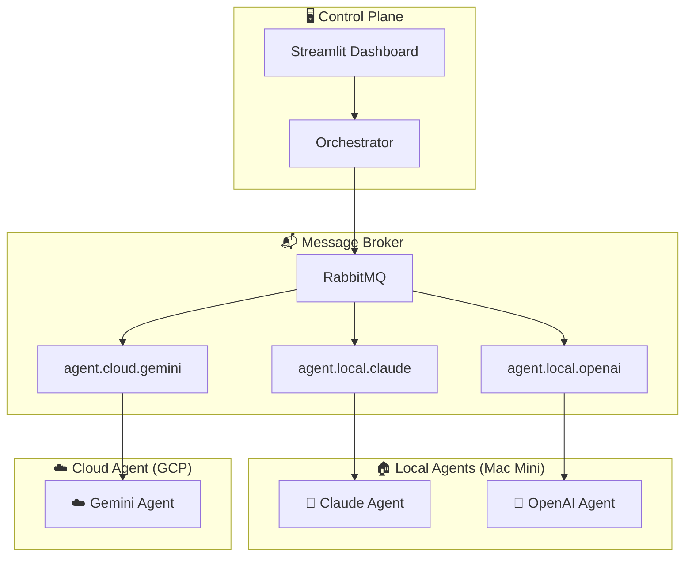
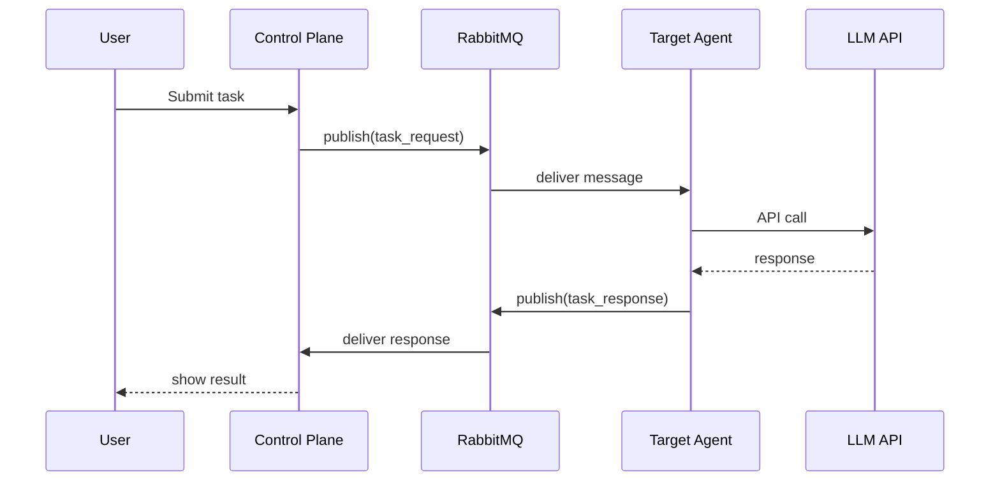
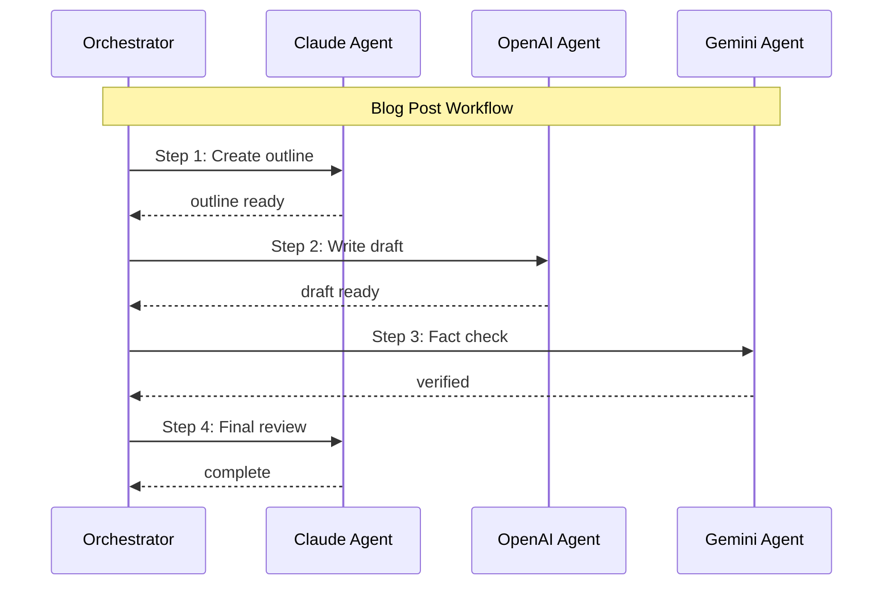
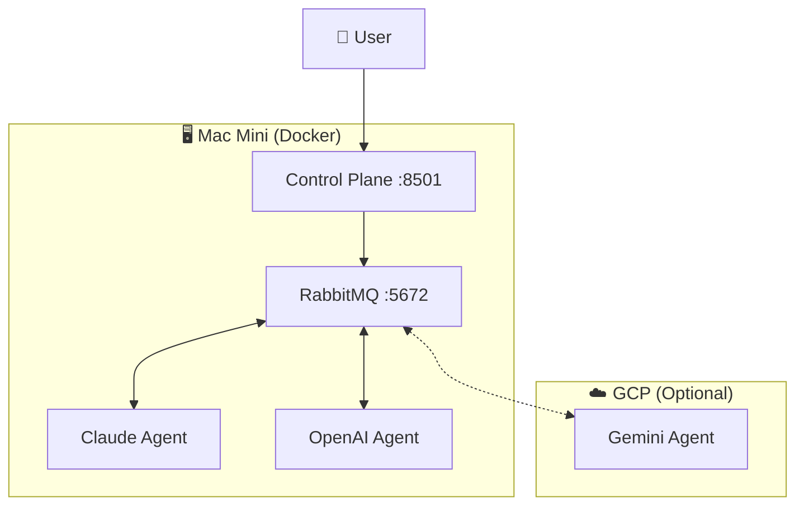

# 🌐 Federated Multi-Agent System - Architecture

## System Overview

```mermaid
flowchart TB
    subgraph UI["🖥️ Control Plane"]
        Dashboard["Streamlit Dashboard"]
        Orchestrator["Orchestrator"]
    end

    subgraph Broker["📬 Message Broker"]
        RabbitMQ["RabbitMQ"]
        Q1["agent.local.claude"]
        Q2["agent.local.openai"]
        Q3["agent.cloud.gemini"]
    end

    subgraph Local["🏠 Local Agents (Mac Mini)"]
        Claude["🤖 Claude Agent"]
        OpenAI["💬 OpenAI Agent"]
    end

    subgraph Cloud["☁️ Cloud Agent (GCP)"]
        Gemini["☁️ Gemini Agent"]
    end

    Dashboard --> Orchestrator
    Orchestrator --> RabbitMQ
    
    RabbitMQ --> Q1 --> Claude
    RabbitMQ --> Q2 --> OpenAI
    RabbitMQ --> Q3 --> Gemini
```

## Message Flow

```mermaid
sequenceDiagram
    participant User
    participant UI as Control Plane
    participant MQ as RabbitMQ
    participant Agent as Target Agent
    participant LLM as LLM API

    User->>UI: Submit task
    UI->>MQ: publish(task_request)
    MQ->>Agent: deliver message
    Agent->>LLM: API call
    LLM-->>Agent: response
    Agent->>MQ: publish(task_response)
    MQ->>UI: deliver response
    UI-->>User: show result
```

## Multi-Agent Workflow

```mermaid
sequenceDiagram
    participant Orch as Orchestrator
    participant Claude as Claude Agent
    participant OpenAI as OpenAI Agent
    participant Gemini as Gemini Agent

    Note over Orch,Gemini: Blog Post Workflow

    Orch->>Claude: Step 1: Create outline
    Claude-->>Orch: outline ready

    Orch->>OpenAI: Step 2: Write draft
    OpenAI-->>Orch: draft ready

    Orch->>Gemini: Step 3: Fact check
    Gemini-->>Orch: verified

    Orch->>Claude: Step 4: Final review
    Claude-->>Orch: complete
```

## Deployment

```mermaid
flowchart TB
    subgraph MacMini["🖥️ Mac Mini (Docker)"]
        RMQ["RabbitMQ :5672"]
        CP["Control Plane :8501"]
        AC["Claude Agent"]
        AO["OpenAI Agent"]
    end

    subgraph GCP["☁️ GCP (Optional)"]
        AG["Gemini Agent"]
    end

    User["👤 User"] --> CP
    CP --> RMQ
    RMQ <--> AC & AO
    RMQ <-.-> AG
```

---

*Project 5.3 | learn-agentic-stack*